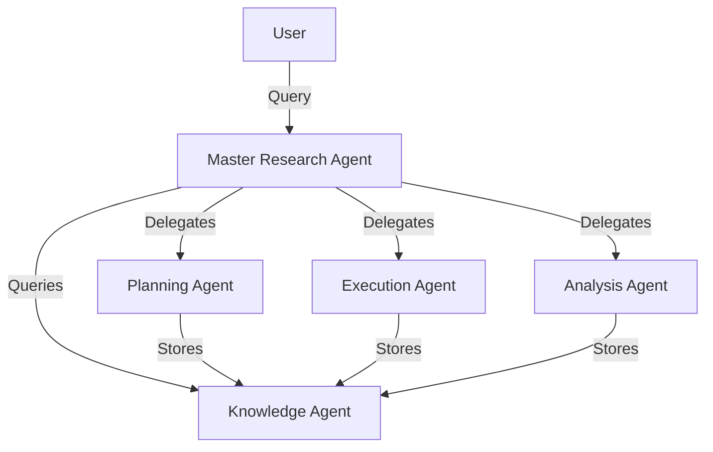

# MAGI: Manus Artificial General Intelligence for academic research assistance with human-in-the-loop AI agents

MAGI (Manus Artificial General Intelligence) is a system designed to assist with materials science research by coordinating multiple specialized AI agents under human supervision.

## Overview

MAGI consists of a Master Research Agent that coordinates several specialized sub-agents:

1. **Master Research Agent**: Coordinates the workflow between sub-agents and serves as the main interface for users.
2. **Planning Agent**: Handles research planning, literature review, and experimental design.
3. **Execution Agent**: Manages experiment execution, simulation runs, and data collection.
4. **Analysis Agent**: Performs data analysis, visualization, and interpretation.
5. **Knowledge Agent**: Manages research artifacts, references, and knowledge retrieval.

## Installation

1. Clone the repository:
   ```bash
   git clone https://github.com/yourusername/gemini-ai-agent.git
   cd gemini-ai-agent/agents/academic-research
   ```

2. Create and activate a virtual environment:
   ```bash
   python -m venv venv
   source venv/bin/activate  # On Windows: venv\Scripts\activate
   ```

3. Install dependencies:
   ```bash
   pip install -r requirements.txt
   ```

4. Set up environment variables:
   Create a `.env` file in the project root with your Google Cloud credentials:
   ```
   GOOGLE_APPLICATION_CREDENTIALS="path/to/your/service-account-key.json"
   ```

## Usage

```python
from MAGI.agent import root_agent

# Initialize the MAGI system
agent = root_agent

# Start a research task
response = agent.process("Help me design an experiment to study the properties of graphene oxide.")
print(response)
```

## Architecture



## Features

- **Human-in-the-loop**: Critical decisions require human approval
- **Modular Design**: Easy to extend with new agents and tools
- **Knowledge Management**: Built-in vector database for research artifacts
- **Reproducibility**: Full audit trail of all research activities

## License

This project is licensed under the Apache License 2.0 - see the [LICENSE](LICENSE) file for details.
